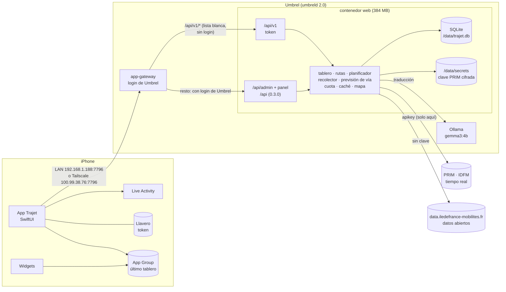

# Trajet · app iOS

La app de Trajet es **la del iPhone**: nativa, en SwiftUI, para mirar de reojo
si llego a los trenes de mis trayectos habituales por Île-de-France, con el
tiempo real del portal PRIM. El Umbrel es **solo el servidor**: la API que
consume la app y un panel para lo que no se hace desde el móvil (pegar la
clave de PRIM, emparejar el iPhone con un QR, ver la cuota). No hay web de
usuario.

- Este repo (`Ismaeloul/trajet-ios`, público): la app, sus tests, el
  laboratorio de diseño y **toda la documentación** del proyecto (`docs/`).
- El servidor (`Ismaeloul/trajet-server`, privado): su README explica cómo se
  despliega en el Umbrel.

---

## Cómo encaja todo



- La app habla solo con `/api/v1/*`, que queda fuera del login de Umbrel pero
  exige un **token de dispositivo** (salvo `ping` y `pair`). El panel y la API
  vieja de la 0.3.0 van detrás del login.
- La clave de PRIM vive solo en el servidor: la app nunca la ve.
- Las direcciones del servidor **no están en el código**: llegan en el QR y se
  pueden cambiar en Ajustes.

Lo que consume la app, con el contrato congelado en
[`docs/openapi.yaml`](docs/openapi.yaml): `ping`, `pair`, `devices/me`,
`health`, `board`, `routes` (lista, alta, edición, borrado, `from-plan` y el
`map` de cada ruta), `search/stops`, `search/places`, `stops/{id}/lines` y
`/directions`, `plan`, `alternatives/{id}` (solo al pedirlas, nunca en el
refresco), `stats` y `platform-model`. Los GET llevan `ETag` y la app manda
`If-None-Match`.

El resto de diagramas (servidor por dentro, panel y seguridad, secuencia del
emparejamiento, la app, el modo trayecto, la Live Activity y el despliegue)
están en [`docs/arquitectura.md`](docs/arquitectura.md).

---

## Emparejar el iPhone con el QR

Desde el panel del Umbrel (con tu login de Umbrel):

1. **Ajustes** del panel: la dirección de casa (`http://<IP del NAS>:7796`) y
   la de Tailscale. Son las que irán dentro del QR.
2. **Emparejar un iPhone**: el panel genera un QR y un código `ABCD-EFGH`
   con una cuenta atrás de **5 minutos**. El QR es un enlace
   `trajet://pair?v=1&code=…&lan=…&ts=…&name=…` con las dos direcciones y el
   nombre del servidor. Un QR nuevo anula el anterior.
3. En la app, la primera pantalla es **«Escanear el QR»**: pide permiso de
   cámara después de explicarlo, enfoca el QR, prueba las direcciones en
   orden (`GET /api/v1/ping`), canjea el código (`POST /api/v1/pair`) y en
   uno o dos segundos dice «Listo». El panel pasa solo a «Emparejado» con el
   nombre del iPhone.
4. La primera vez que la app habla con la red de casa, iOS pide permiso de
   **red local**: hay que dárselo o esa dirección no responderá (Tailscale
   sí).

También vale:

- **A mano** («Escribir a mano»): el código (da igual mayúsculas o el guion)
  y la dirección de casa; la de Tailscale la rellena el servidor al
  emparejar.
- **La cámara del sistema**: al enfocar el QR sale el enlace `trajet://pair…`
  y al tocarlo se abre Trajet y empareja igual.

Lo que hay detrás: el código sirve **una sola vez**; malo, caducado o ya usado
dan exactamente la misma respuesta, y demasiados intentos dan 429. El token
(`trj_` + 256 bits aleatorios) va al **Llavero** del iPhone (accesible tras el
primer desbloqueo, porque el modo trayecto lo necesita con el iPhone
bloqueado); el servidor solo guarda su hash. En **Ajustes** de la app:
«Probar conexión», «Emparejar de nuevo» (el dispositivo viejo se queda en la
lista del panel: hay que revocarlo allí) y «Desemparejar este iPhone». Si se
revoca desde el panel, el tablero dice «iPhone sin emparejar» y se conserva
lo último que se vio.

---

## Modo trayecto

**Se enciende a mano**, con «Empezar trayecto» en el tablero o en la pestaña
Trayecto; nunca está encendido siempre. La primera vez explica para qué quiere
la ubicación antes de que iOS pregunte; si se deniega, el trayecto sigue sin
GPS (sin llegada automática) y el resto de la app funciona igual.

Mientras dura:

- ubicación en segundo plano con **precisión baja** (~100 m), y solo
  entonces (`allowsBackgroundLocationUpdates` se enciende al empezar y se
  apaga al terminar);
- el tablero se sigue refrescando cada 30 s aunque la app esté detrás (o al
  ritmo que pida el servidor, nunca menos de 30 s);
- la Live Activity se pone al día con cada tablero (en la IPA full);
- si cierras la app del todo, el trayecto **sigue** (se guarda en disco) y la
  Live Activity es la misma.

**Se apaga solo** al llegar al destino (a menos de ~150 m de la estación de
destino, y solo después de haber estado lejos: empezar al lado no cuenta) o
al pasar el **tiempo máximo** (90 min por defecto; en Ajustes, de 15 min a
4 h). También se para a mano desde la app o con «Parar» en la Live Activity
(un App Intent), y al desemparejar el iPhone. Si termina sola (llegada o
tiempo máximo), la Live Activity dice por qué y se quita 15 min después; si
la paras a mano, desaparece al momento.

**Geocercas** (opcional, Ajustes › Modo trayecto › «Geocercas en tus
estaciones»): monitorización de regiones (`CLMonitor`) de radio 200 m en las
estaciones habituales (por defecto, las paradas donde empiezan tus rutas;
hasta 20). Necesita el permiso de ubicación **«Siempre»**. Al entrar en una,
iOS despierta la app unos segundos, pide el tablero (sin engordar el
historial) y actualiza la Live Activity si hay una; como mucho una vez cada
5 min por geocerca. Fuera de eso, el bucle está parado.

Los textos de los permisos (red local, cámara, ubicación «cuando se usa» y
«siempre») están en español en [`Trajet/App/Info.plist`](Trajet/App/Info.plist).
Lo que gasta y cómo medirlo: [`docs/rendimiento.md`](docs/rendimiento.md)
(los números los rellena quien lo pruebe en el iPhone).

---

## Live Activity y widgets

**Live Activity** (pantalla de bloqueo y Dynamic Island compacta, mínima y
expandida) mientras hay un trayecto: distintivo de la línea, destino, la
cifra de minutos que **baja sola** sin la app (`Text(timerInterval:)`), la vía
real o probable, el siguiente tren o el transbordo, la **antigüedad del dato**
siempre a la vista y el botón «Parar». Alerta (la isla se expande y vibra)
cuando aparece o cambia la vía y cuando se cancela un tren; un cambio de
minuto nunca alerta. No hay notificaciones push: se empieza con la app
delante y se actualiza desde el modo trayecto y las geocercas. Solo pinta lo
que la app escribió: si la app deja de escribir, pasa a gris con horas de
salida fijas y «sin actualizar · hace N min», en vez de una cuenta atrás que
miente.

**Widgets** de inicio (pequeño, mediano y grande) y de bloqueo (circular con
`Gauge`, rectangular y en línea): el próximo tren de la ruta que toca, su vía
y la antigüedad. Leen el último tablero de la caché compartida y son «una
foto con fecha»: una entrada por minuto que sigue bien aunque no se
refresque, y al acabarse las salidas conocidas, «Sin datos recientes · abre
Trajet». Se recargan como mucho una vez cada 2 min. En tintado y en la
pantalla de bloqueo (monocromo) la vía real y la probable se distinguen por
forma y palabra, no por color.

**Por qué dependen de cómo se firme.** La extensión
(`com.ismaeloul.trajet.widgets`) y la app comparten el último tablero por el
App Group `group.com.ismaeloul.trajet`. Un Apple ID gratuito **no da App
Groups**, así que sin él no hay widgets ni Live Activity. La app lo mira en
tiempo de ejecución (`Capabilities`) y, si no lo tiene, no los ofrece y lo
dice en Ajustes › «Widgets y Live Activity»; nada se rompe. El diseño y sus
límites (tamaños, `staleDate`, presupuesto de WidgetKit) están en
[`docs/diseno/decisiones-la-widgets.md`](docs/diseno/decisiones-la-widgets.md).

---

## Qué IPA usar según cómo firmes

El CI deja **dos IPA sin firmar** del mismo código y con el **mismo bundle
id** (`com.ismaeloul.trajet`): instalar una encima de la otra conserva el
emparejamiento, las direcciones y la caché.

| | firmar con | qué lleva | caducidad |
|---|---|---|---|
| `Trajet-full.ipa` | certificado tipo **Signulous** (de empresa o desarrollador, con App Groups) | la app + la extensión de widgets y Live Activity + el App Group | la del certificado |
| `Trajet-lite.ipa` | **Apple ID gratuito** vía IPA Station (o Sideloadly) | solo la app: sin extensiones, sin App Group, sin Live Activity | **7 días**; luego hay que reinstalar (no se pierde nada) |

- La full lleva una firma ad hoc **solo** para que los entitlements viajen
  dentro de la IPA y el firmador los vea; el firmador la sustituye por la
  suya. Al firmar, conviene comprobar que los entitlements incluyen
  `group.com.ismaeloul.trajet`; si la app instalada dice «no disponibles»
  en Ajustes › Widgets y Live Activity, es cosa de la firma, no de la app.
- La lite se compila con la condición `TRAJET_LITE` y con
  `NSSupportsLiveActivities = false`; el CI comprueba que no lleva
  `PlugIns/` y que la full sí lleva el App Group (`scripts/ci-ipa.sh`).
- Reinstalar encima no borra nada: lo que guarda la app (token en el
  Llavero, direcciones, último tablero) sobrevive porque el identificador no
  cambia nunca (R58).

---

## Cómo se saca el .ipa

No hay Mac: **la app se compila en GitHub Actions**, en un runner macOS con
el Xcode más nuevo de la imagen. Lo hace
[`.github/workflows/ios.yml`](.github/workflows/ios.yml):

```
push a main o rewrite-v2 (o Run workflow, o un tag v*)
   ↓
runner macOS · xcodegen + xcodebuild (CODE_SIGNING_ALLOWED=NO)
   ↓
scripts/ci-ipa.sh → Trajet-full.ipa y Trajet-lite.ipa   ← artefacto «Trajet-ipa-<nº>»
scripts/ci-tests.sh → tests unitarios y de interfaz     ← «Trajet-xcresult-<nº>»
   ↓
el firmador (Signulous o IPA Station) → iPhone
```

Tres modos, para no gastar minutos de macOS porque sí:

| modo | qué hace | cuándo |
|---|---|---|
| `compilar` | solo comprueba que todo compila: app, lite, extensión y tests | a mano |
| `completo` | compilar + las dos IPA + tests unitarios y de interfaz | cada `push` (salvo si solo cambian `README.md`, `docs/` o `design-lab/`) |
| `capturas` | completo + capturas en iPhone SE, 16 y 16 Pro Max, claro y oscuro y letra grande, en cuatro trabajos en paralelo | a mano, y en los tags `v*` |

Para bajar las IPA: pestaña **Actions** → la ejecución → *Artifacts* →
`Trajet-ipa-N` (un zip con las dos IPA; se guarda 30 días). También quedan
`Trajet-xcresult-N` y `Trajet-logs-N` (7 días) y, en modo capturas,
`Trajet-capturas-N` (30 días; `gh run download <id> -n Trajet-capturas-N`).
En la lista de Actions el workflow sale con el nombre que tiene en `main`
(«IPA»); en esta rama el fichero se llama «iOS».

En los **tags `v*`** las dos IPA se adjuntan además a una **Release** de
GitHub. Como el repo es público, los minutos de macOS no cuentan.

### Compilar en un Mac, si algún día hay uno

```bash
brew install xcodegen
xcodegen generate        # crea Trajet.xcodeproj a partir de project.yml
open Trajet.xcodeproj
```

El `.xcodeproj` **no se versiona**: se genera. Lo que se edita es
[`project.yml`](project.yml). Esquemas: `Trajet` (full, con la extensión y
los tests) y `TrajetLite`.

---

## Cómo está montado

SwiftUI, **iOS 17 mínimo** (los extras de iOS 26, como Liquid Glass, tras
`if #available`), **Swift 6 con concurrencia estricta**, `@Observable`, sin
dependencias externas.

```
Trajet/
  Shared/               se compila en la app Y en la extensión (sin framework: menos piezas que firmar)
    Model/              Board, Routes, Plan, Stats, Health, RouteMap, Pairing… (decodificación tolerante)
    Design/             tokens «Cristal», tipografía, cristal, colores de línea, Format («1h46», «hace 5 min»)
    Components/         el billete de minutos, la marca de vía, el modelo de las piezas de widgets y Live Activity
    Cache/              BoardCache: el último tablero en disco (en el App Group si existe)
    Activity/           TrajetActivityAttributes, StopTripIntent («Parar»), WidgetRefresher
    Capabilities.swift  ¿hay App Group? ¿extensiones? (en tiempo de ejecución)
  App/
    TrajetApp, RootView, Info.plist, Info-Lite.plist, Trajet.entitlements
    Net/                TrajetAPI (actor: dos direcciones, reintento, ETag), ServerConfig, Keychain, APIError
    Store/              BoardStore (el bucle de 30 s y la caché), RoutesStore, MapStore, HealthStore, PairingStore, AppServices
    Trip/               TripController (la máquina de estados), LocationService, GeofenceService, ActivityController, TripSettings
    Demo/               servidor falso en proceso (URLProtocol) para las capturas y los tests de interfaz (-demo)
    Views/              Board · Map · Routes · Settings · Stats · Pairing · Common
  Resources/            Assets.xcassets (icono en claro, oscuro y tintado; colores generados) y PreviewData
TrajetWidgets/          la extensión: widgets de inicio y de bloqueo, Live Activity y Dynamic Island
TrajetTests/            XCTest
TrajetUITests/          XCUITest (flujos y CapturasUITests)
design-lab/             el laboratorio de diseño (HTML) del que sale «Cristal» y sus tokens
docs/                   toda la documentación del proyecto
```

Dos apps en `project.yml` con el mismo bundle id: `Trajet` (full, embebe
`TrajetWidgets`, con el App Group) y `TrajetLite` (sin extensión ni App Group,
`TRAJET_LITE`).

### `PreviewData` hace de banco de pruebas

No son maquetas: son respuestas con la forma exacta de la API v1, elegidas
para cubrir lo que un JSON feliz esconde (tramo vacío, línea cortada, aviso
sin traducir, vía que aparece, vía solo probable, bus a 106 minutos, tren
parado en el andén, destinos mezclados y más), más los errores con código y
los estados de salud. Los usan los tests, las vistas previas de Xcode y el
servidor falso de la demo; los mocks de PRIM del servidor reproducen los
mismos casos.

---

## Diseño «Cristal»

La app sigue la dirección **B «Cristal»** del laboratorio (`design-lab/`),
pasada a nativo. En corto: el cristal (Liquid Glass) es la capa de controles;
los minutos y la vía van siempre en opaco (el «billete»); los colores
significan (neutros, azul solo para lo que se toca, amarillo solo para la vía
confirmada, y los colores oficiales de línea); las cifras mandan (SF Pro
Rounded heavy, dígitos tabulares); movimiento con muelle y siempre con
alternativa para «Reducir movimiento». **Modo claro y oscuro**, Dynamic Type,
VoiceOver, «Aumentar contraste» y «Reducir transparencia» (el cristal pasa a
opaco). Icono nuevo, con variantes clara, oscura y tintada.

Los colores no se eligen a ojo: `design-lab/tools/tokens.mjs` parte de los
valores OKLCH, comprueba 147 parejas texto/fondo y el distintivo de 59
colores de línea contra WCAG, y genera `tokens.json`, `Tokens.swift` y los
colorsets. Los colores de línea vienen en `line_color` de la API y son los
únicos saturados de la pantalla.

- [`docs/diseno/sistema.md`](docs/diseno/sistema.md): tokens, tipografía,
  componentes y estados, animaciones, y §12 la Live Activity y los widgets.
- [`docs/diseno/decisiones-la-widgets.md`](docs/diseno/decisiones-la-widgets.md):
  por qué la variante A «Billete» para la Live Activity y los widgets.
- [`docs/diseno/ajustes-b.md`](docs/diseno/ajustes-b.md): lo que había que
  corregir de B al pasarlo a nativo.
- [`docs/diseno/referencias-la-widgets.md`](docs/diseno/referencias-la-widgets.md).

---

## Lo que decide el diseño

No es una app de planificar viajes: es de **mirar de reojo si llego**. De pie,
andando por una estación, con una mano, dos o tres segundos, a contraluz. De
ahí salen casi todas las decisiones.

Estos números están **medidos** contra la API real (sondeo del 30 de agosto,
32 122 observaciones) y son los que mandan sobre la pantalla:

| dato | consecuencia en la app |
|---|---|
| La vía aparece solo en el **17 %** de los trenes, con 7,7 min de mediana | la vía nunca es una columna fija; cuando aparece, **se canta** (caja amarilla, latido y vibración) |
| Metro, bus y tranvía **no publican vía jamás** (0 de ~600) | en esos modos no se reserva el hueco: sería un vacío permanente |
| **26 de 36** líneas no mandan hora teórica | en metro y bus no hay retraso que enseñar, y no se finge |
| **No existe** dato de ocupación | donde el prototipo dibujaba «crowding» va `length`, que sí es real (tren corto/largo, en el 61 % de las salidas) |
| Hay buses a **106 y 165 min** | los minutos se pintan `1h46`, no `106` |
| Cuota de **1000 llamadas/día** por endpoint | el tablero se refresca cada 30 s **solo mientras se está mirando o durante un trayecto**; si el servidor va justo de cuota, pide un ritmo más lento (`refresh_hint_s`) y la app obedece |
| Los avisos llegan **en francés** y se traducen aparte | se enseña el francés y se dice «traduciendo»; nunca se espera al modelo |

Tres reglas que no se negocian:

1. **Nunca se borra la pantalla.** Si la API falla, se queda el último tablero
   bueno y lo que cambia es su antigüedad. Se guarda en disco, así que la
   primera apertura del día tampoco enseña un hueco. Vale también tramo a
   tramo: si una estación falla, sus últimas salidas se quedan, atenuadas.
2. **La vía probable no puede leerse como la real.** No se distinguen por un
   matiz de color, que a contraluz se pierde, sino por la forma y la palabra:
   caja sólida con «Vía» contra recuadro punteado con «probable».
3. **Con el dato viejo se apaga el tablero entero**, no una etiqueta. Viejo
   es que el servidor lo marque `stale` o que el teléfono lleve más de 90 s
   sin recibir un tablero nuevo. Esto cambió en la v2 (R19): como cada
   estación se pide a su ritmo, un `data_age` de 300 s con el próximo tren a
   40 min **no** es un dato viejo; la antigüedad que se enseña sigue siendo la
   real.

Todas las reglas, numeradas (R1–R62 de la app, R63–R90 del servidor) y con el
test que cubre cada una, están en [`docs/reglas.md`](docs/reglas.md): 73
cubiertas, 11 parciales y 6 sin test (las de puro aspecto, que se miran en las
capturas y en el iPhone).

---

## Tests y capturas

En cada ejecución `completo` del CI (`scripts/ci-tests.sh`, simulador
iPhone 16):

- **XCTest** (`TrajetTests/`): decodificación con todos los `PreviewData`,
  formato, reglas de la vía, el store del tablero (bucle, caché, errores que
  no borran nada), la máquina de estados del trayecto, el cliente con las dos
  direcciones y fallos de red (con `URLProtocol` falso), emparejamiento,
  rutas, estadísticas y ajustes, mapa, abreviado de destinos, y el contenido
  de la Live Activity y de los timelines de los widgets.
- **XCUITest** (`TrajetUITests/`) contra el servidor falso en proceso
  (`-demo`): emparejar con código, tablero, trayecto, mapa, alternativas,
  rutas y ajustes.

Las **capturas** (`CapturasUITests`, `scripts/ci-capturas.sh`) se hacen en
modo `capturas`: iPhone SE (3.ª gen.), iPhone 16 y iPhone 16 Pro Max, en
claro y oscuro, más el iPhone 16 con letra grande, con la barra de estado
limpia (9:41). Salen en el artefacto `Trajet-capturas-N`, con una carpeta por
dispositivo y modo.

Las capturas y el informe de las pruebas del **panel** en el navegador (móvil
y PC, claro y oscuro, con consola y red vigiladas) están en
[`docs/capturas/panel-fase4/`](docs/capturas/panel-fase4/README.md) y
[`docs/fase4-panel.md`](docs/fase4-panel.md).

---

## Pruebas en el iPhone

Lo que el simulador no prueba bien va en una lista de comprobación paso a
paso, con el resultado esperado de cada punto:
[`docs/pruebas-iphone.md`](docs/pruebas-iphone.md). Cubre instalar las dos
IPA, emparejar con el panel de verdad, GPS y llegada automática, tiempo
máximo, parar desde la Live Activity, geocercas con la app cerrada, la Live
Activity con el iPhone bloqueado, widgets (también tintados y en el bloqueo),
batería, legibilidad a contraluz, red local y Tailscale, cambios de red
durante un trayecto, VoiceOver y letra grande.

---

## Red

Dos direcciones, las que trajo el QR: la de casa y la de Tailscale. Se
prueban en orden y se recuerda la que responde. Un fallo de red salta a la
siguiente; un error del servidor (4xx/5xx) no. Timeouts cortos (6 s por
petición, 12 s por recurso) para que, si la red de casa no está, se descarte
antes de que pase el refresco de 30 s.

| | dirección | cuándo sirve |
|---|---|---|
| Red de casa | `http://<IP del NAS>:7796` (p. ej. `192.168.1.188`) | en casa, sin pasar por el relé |
| Tailscale | `http://<IP de Tailscale>:7796` o el nombre MagicDNS `http://<nombre>.<tailnet>.ts.net:7796` | desde la calle y con datos |

Se pueden editar en **Ajustes › Servidor** (se guardan según se escriben;
«Restablecer direcciones» vuelve a las del emparejamiento), con «Probar
conexión» y «Conectado por» para ver cuál responde.

**ATS**: el servidor sirve HTTP plano, y la app lo permite solo donde hace
falta, sin `NSAllowsArbitraryLoads`:

- `NSAllowsLocalNetworking` para la red de casa (RFC 1918, link-local,
  `.local` y nombres sin dominio);
- excepción para `100.64.0.0/10`, el rango de Tailscale (CGNAT, que iOS no
  considera local; las claves CIDR valen desde iOS 17);
- excepción para `ts.net`, los nombres MagicDNS de Tailscale.

Una dirección pública por HTTP no funcionará, y Ajustes lo avisa al
escribirla. La primera vez iOS pide permiso para la **red local**: sin él
solo funciona Tailscale.

---

## Documentación

Toda la del proyecto, servidor incluido, vive en [`docs/`](docs/):

| documento | qué cuenta |
|---|---|
| [`PARADAS.md`](docs/PARADAS.md) | el informe de cada fase: qué se hizo, tests, verificaciones, pendientes |
| [`decisiones.md`](docs/decisiones.md) | cada decisión, con alternativas y por qué (D0.x a D3.x) |
| [`reglas.md`](docs/reglas.md) | las 90 reglas que no se pueden romper y el test que cubre cada una |
| [`arquitectura.md`](docs/arquitectura.md) | cómo encajan iPhone, Umbrel, PRIM y el panel, con diagramas |
| [`app-v2.md`](docs/app-v2.md) · [`app-v2-api.md`](docs/app-v2-api.md) | el diseño técnico de la app y la API interna de su núcleo |
| [`inventario-funcional.md`](docs/inventario-funcional.md) | todo lo que hacía la v1, para que nada se perdiera |
| [`ios-reutilizable.md`](docs/ios-reutilizable.md) | qué se reutilizó de la app anterior |
| [`api.md`](docs/api.md) · [`openapi-0.3.0.yaml`](docs/openapi-0.3.0.yaml) | la API de la 0.3.0, sacada del código |
| [`openapi.yaml`](docs/openapi.yaml) | el contrato v1, **congelado** (el servidor lo copia en `tests/contract/`) |
| [`servidor.md`](docs/servidor.md) · [`servidor-v2.md`](docs/servidor-v2.md) | el servidor 0.3.0 y por qué cada constante vale lo que vale; la v2 por dentro |
| [`datos-idfm.md`](docs/datos-idfm.md) | los datos abiertos de IDFM del mapa y sus licencias |
| [`diseno/`](docs/diseno/) | el sistema «Cristal», la Live Activity y los widgets, referencias y ajustes |
| [`rendimiento.md`](docs/rendimiento.md) | qué gasta el modo trayecto, cómo se mide y la tabla de resultados |
| [`pruebas-iphone.md`](docs/pruebas-iphone.md) | la lista de comprobación en el iPhone |
| [`fase4-panel.md`](docs/fase4-panel.md) · [`capturas/`](docs/capturas/) | el panel probado en el navegador, con capturas y GIF |
| [`encargos-fase3/`](docs/encargos-fase3/) | los encargos con los que se repartió la app entre agentes |
| [`pendiente.md`](docs/pendiente.md) · [`PROGRESO.md`](docs/PROGRESO.md) | lo que queda y el diario |
| [`RESUMEN-MAÑANA.md`](docs/RESUMEN-MAÑANA.md) | qué está hecho, qué decidí, qué queda y qué probar primero |
