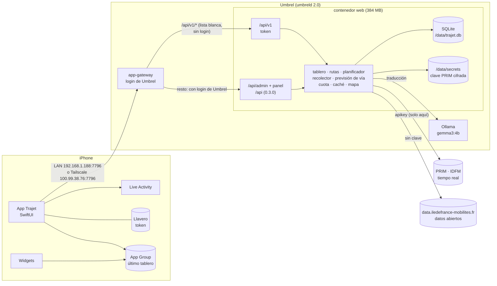
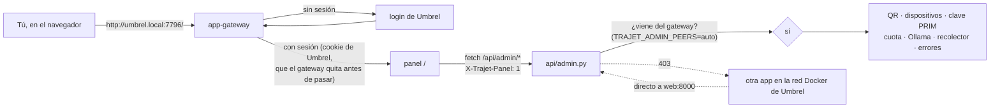
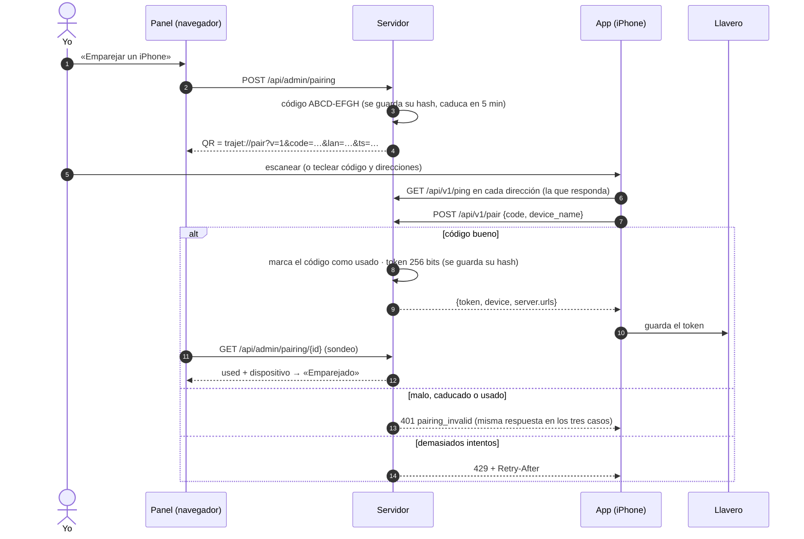
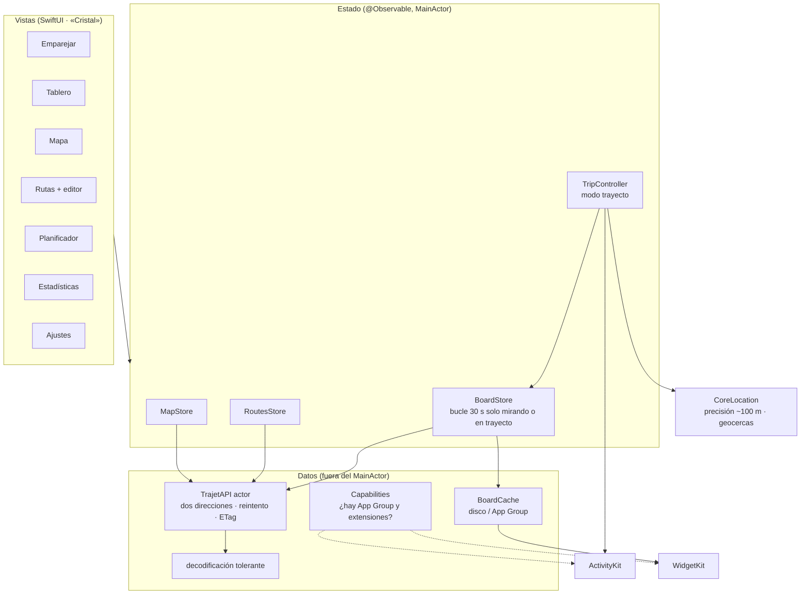
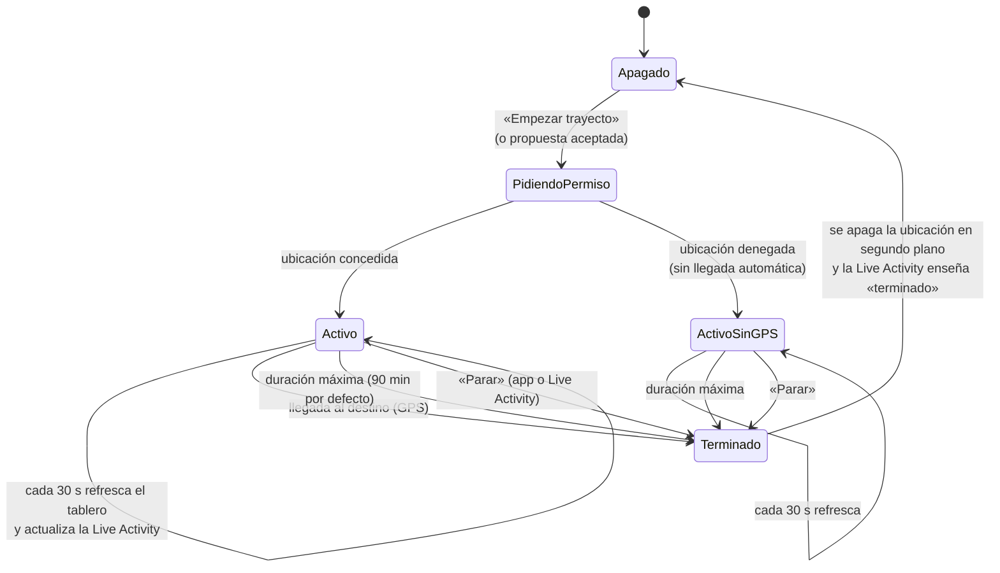
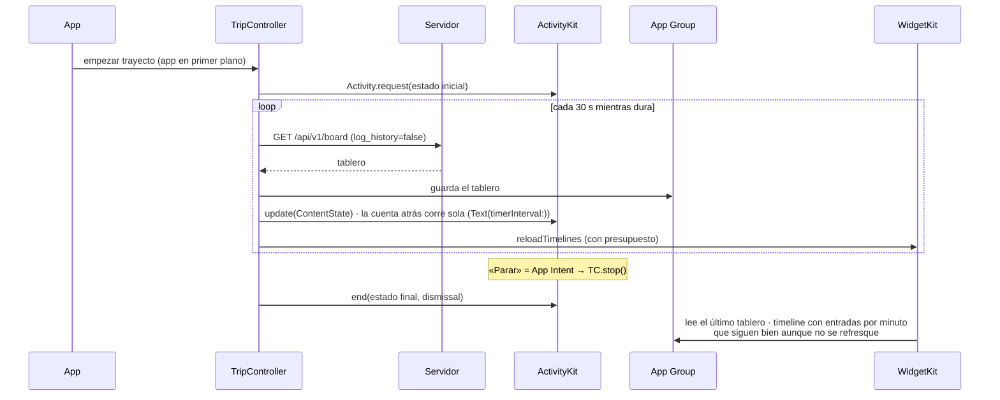

# Arquitectura de Trajet v2

Dos piezas: la **app del iPhone** (la de verdad) y el **servidor en el
Umbrel** (API + panel). Aquí va cómo encajan. El detalle de cada parte está
en `docs/servidor.md` (cómo es hoy), `docs/servidor-v2.md` (cómo es por
dentro la v2), `docs/openapi.yaml` (el contrato) y `docs/diseno/` (el
aspecto).

## 1. Vista general



- Las direcciones del servidor **no están en el código**: llegan en el QR y
  se guardan en la app; se pueden cambiar en Ajustes.
- La clave PRIM vive solo en el servidor. La app nunca la ve.

## 2. Servidor por dentro

```mermaid
flowchart TB
  subgraph HTTP
    MW[middlewares<br/>gzip · ETag · cabeceras de seguridad<br/>filtro de secretos en logs]
    V1[api/v1.py]
    LEG[api/legacy.py]
    ADMIN[api/admin.py]
    PANEL[panel/ HTML+CSS+JS]
  end
  AUTH[auth.py<br/>emparejamiento · tokens · rate limit<br/>comprobación del proxy]
  COMMON[api/common.py]
  BOARD[board.py]
  PLAN[planner.py]
  ALT[alternativas]
  COL[collector.py<br/>tarea de fondo]
  PLAT[platform.py<br/>previsión de vía]
  TR[translate.py<br/>Ollama en segundo plano]
  MAP[mapdata.py<br/>IDFM open data]
  PRIMC[prim.py<br/>caché con TTL · lock por clave<br/>clave en caliente]
  QUOTA[quota.py<br/>por endpoint y día UTC]
  KS[keystore.py<br/>AES-GCM · HKDF(APP_SEED)]
  LOGS[logs.py<br/>error_log]
  MIG[migrations/]
  DB[(SQLite)]

  MW --> V1 & LEG & ADMIN & PANEL
  V1 --> AUTH
  ADMIN --> AUTH
  V1 & LEG --> COMMON
  COMMON --> BOARD & PLAN & ALT & PLAT & TR & MAP
  BOARD --> PRIMC
  PLAN --> PRIMC
  ALT --> PRIMC
  COL --> PRIMC
  COL --> PLAT
  PRIMC --> QUOTA
  PRIMC --> KS
  ADMIN --> KS & QUOTA & LOGS
  PLAT & TR & MAP & AUTH & QUOTA & LOGS --> DB
  MIG --> DB
```

Reglas de la casa: un solo proceso (la caché, la cuota y el recolector viven
en memoria), SQLite fuera del bucle de eventos, nada de trabajo pesado en la
petición del tablero, y el último dato bueno siempre se conserva.

## 3. Panel y seguridad



| superficie | protección |
|---|---|
| `/api/v1/*` | fuera del login (lista blanca) + token de dispositivo |
| `/api/v1/pair` | código de 5 min de un solo uso + rate limit |
| panel y `/api/admin/*` | login de Umbrel + cabecera anti-CSRF + origen de la conexión |
| `/api/*` (0.3.0) | detrás del login, como el panel |

## 4. Emparejamiento



## 5. App del iPhone



- **Lite / full**: la misma app. `Capabilities` mira en tiempo de ejecución
  si hay App Group (y por tanto extensiones útiles). Sin él, no se ofrecen la
  Live Activity ni los widgets y la caché va al contenedor de la app.
- **Nunca se borra la pantalla**: la caché en disco se pinta al arrancar
  (< 1 s) antes de pedir nada.

## 6. Modo trayecto



- Ubicación en segundo plano **solo** mientras dura el trayecto, con
  precisión reducida (~100 m).
- **Geocercas** (monitorización de regiones) en las estaciones habituales:
  al entrar, iOS despierta la app unos segundos, pide el tablero y actualiza
  la Live Activity si hay una. Fuera de eso, el bucle está parado (R7).

## 7. Live Activity y widgets



Sin notificaciones push (no hay cuenta de desarrollador de pago): la Live
Activity se empieza en primer plano y se actualiza desde el modo trayecto y
las geocercas. Los widgets leen la caché del App Group; su cuenta atrás y la
antigüedad del dato corren solas con `Text(date, style:)`.

## 8. Despliegue

```mermaid
flowchart LR
  DEV[trajet-server en el Umbrel<br/>(git pull por SSH)] -->|scripts/publish.sh| REG[(registro local del Umbrel<br/>localhost:5000)]
  STORE[umbrel-app-store<br/>ismaeloul-trajet 0.4.0] --> UMB[umbreld]
  REG --> UMB
  UMB --> WEB[contenedor web · usuario 1000 · healthcheck]
  CI[GitHub Actions · trajet-ios] --> IPA1[Trajet-full.ipa<br/>widgets + Live Activity + App Group]
  CI --> IPA2[Trajet-lite.ipa<br/>sin extensiones]
```

El despliegue en el Umbrel lo haces tú (ver `trajet-server/README.md`): en
esta sesión no se publica nada en el registro ni se toca la app instalada.
